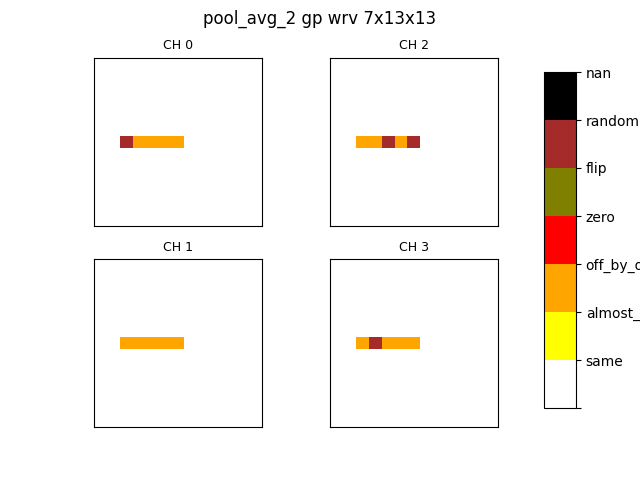

# cnn-error-classifier

Compares corrupted tensors with a gold one, classifying the differences by their domain and their spatial distribution.

## Features

The input of the program is a golden .npy tensor and a folder containing faulty .npy tensors (both NHWC or NCHW formats can be processed).

The program will classify the faulty tensor based on the spatial distribution of the erroneous values. For each tensor an image
that shows visually the differences with the golden tensor will be generated.

The program also generates a json report containing info about the analysis 

# How to run the script
## Folder structure

The results of the injection are divided in batches and sub batches.

To launch a classification open a terminal in the root of the repository and then launch the following command
```sh
python src/main.py <path_to_root> <relative_path_to_golden> <relative_path_to_sub_batches_dirs> <output_path>
```
For understanding what to put in these positional parameters here is an example folder structure

```
root_path
├── batch_1
│   ├── test
│   │   ├── golden.npy
│   │   ├── sub_batch_1
│   │   │   ├── faulty_1.npy
│   │   │   ├── faulty_2.npy
│   │   │   └── faulty_3.npy
│   │   └── fp32_wrv
│   │       ├── faulty_1.npy
│   │       └── faulty_2.npy
│   └── other_dir
├── batch_2
│   └── test
│       ├── golden.npy
│       ├── sub_batch_1
│       │   ├── faulty_1.npy
│       │   └── faulty_2.npy
│       └── sub_batch_2
│           ├── faulty_1.npy
│           ├── faulty_2.npy
│           └── faulty_3.npy
├── batch_3
│   └── test
│       ├── golden.npy
│       ├── sub_batch_1
│       │   ├── faulty_1.npy
│       │   └── faulty_2.npy
│       └── sub_batch_2
│           ├── faulty_1.npy
│           ├── faulty_2.npy
│           └── faulty_3.npy
└── _ignored
```

All the folders right under the root path are called batches. Each batch contains at least one sub-batch. A sub-batch is a directory that contains faulty .npy files directly inside it.

All the batch folders are contained inside the root path (batch_1, batch_2, ...). The folders starting with "_" directly under the root_path folder are ignored.

The path to each batch folder will be called from now on batch_home_path. 

The second argument (relative_path_to_golden) is the relative path from each batch's batch_home_path to the golden .npy file. This relative path is equal for all batches. Using the example above the second argument will be "test/golden.npy". In this way the program will look for a golden.npy file in the paths "root_path/batch_1/test/golden.npy", "root_path/batch_2/test/golden.npy", ...

The third argument is the relative path from each batch's batch_home_path to the directory containing all the sub-batches directories, that will contain the faulty tensors.
Using the example above the second argument will be simply "test". In this way the program will look for subfolders into the path "root_path/batch_1/test", and it will consider all the folders inside that path as sub batch folders. For batch 1 the sub_batches are "sub_batch_1" and "fp32_wrv". All the .npy files inside these folders will be considered as faulty tensors and they will all be compared with the batch golden tensor.

The last argument is the path where you want to put the outputs of the analysis. It's a good practice to put the analysis outcomes in an empty folder.

Summarizing, for the example above the command will be 

```sh
python src/main.py root_path test/golden.npy test output
```
The results of the analysis will be put in a new folder called output, right in the folder where the command was called.

Here is another example
```
root_path
├── batch_1
│   ├── golden.npy
│   ├── sub_batch_1
│   │   ├── faulty_1.npy
│   │   ├── faulty_2.npy
│   │   └── faulty_3.npy
│   └── sub_batch_2
│       ├── faulty_1.npy
│       └── faulty_2.npy
├── batch_2
│   ├── golden.npy
│   ├── sub_batch_1
│   │   ├── faulty_1.npy
│   │   └── faulty_2.npy
│   └── sub_batch_2
│       ├── faulty_1.npy
│       ├── faulty_2.npy
│       └── faulty_3.npy
├── batch_3
│   ├── golden.npy
│   ├── sub_batch_1
│   │   ├── faulty_1.npy
│   │   └── faulty_2.npy
│   └── sub_batch_2
│       ├── faulty_1.npy
│       ├── faulty_2.npy
│       └── faulty_3.npy
├── batch_4
│   ├── golden.npy
│   ├── sub_batch_1
│   │   ├── faulty_1.npy
│   │   └── faulty_2.npy
│   └── sub_batch_2
│       ├── faulty_1.npy
│       ├── faulty_2.npy
│       └── faulty_3.npy
└── _ignored
```
In this case the command will be
```sh
python src/main.py root_path golden.npy . output
```
## Command Line arguments
If run without other options, the program will analyze all the tensors in all sub batches and it will compare them with the golden tensor of their batch. 
For each faulty tensor a spatial and a domain classifications will be performed.
Aggregated data of the classification is put in a general report inside the output folder called "global_report.json"

### NHWC and NCHW tensors
This classifier supports tensors in NHWC and NCHW formats. If no flag is specified the script will assume that the tensor has NCHW format. The "-nhwc" flag will tell the script that the golden tensor and the faulty tensors are packed using the NHWC format

### Visualization
To help you understand how the errors are distributed in the space in the faulty tensors you can add the "-v" (or "--visualize") flag. For each faulty tensor a .png image containing a plot of all corrupted values will be generated. The plot will show only the corrupted channels.



The images will be put in the folder of their spatial class.

If you specify this flag while putting the output in a non empty folder where there are other visualizations, the old visualizations will be erased. If this flag is not specified, the old visualizations are not deleted.

Generating the plots will slowdown the program a lot. If you are able it is recommended to enable the use of multiple process. See the next paragraphs.
### Parallelism

It is possible to divide the work between multiple processes, using multiprocessing. To enable this add the flag "-p N". This will use N worker processes in parallel. The most effective N values depends on the number of cores your CPU. Just don't use an N bigger than the number of cores in the processor. 


### CLASSES models
This script is able to generate models for the CLASSES framework. To enable the generation of these models use the flag "--classes" with two string parameters ("--classes Sx OPERATION"). The parameters are necessary to generate all the files in the format required by CLASSES. If you pass "--classes S1 conv" you will find CLASSES files in the output directory inside the subfolder "S1_conv". 
You may directly copy this folder inside the CLASSES model directory.

### Epsilon

The flag "-eps EPS" ("--epsilon EPS") will set the epsilon to EPS. This value determine the minimum difference (in absolute value) needed to consider two numbers not equal. The default value is 1e-3.
### Partial Reports
You can generate a partial json report for each sub-batch by specifying "-pr" (--partial-reports) flag. The reports will be stored inside the ouput/reports/ folders.
The report contains detailed reports for each sub batch.

## Examples

```sh
python src/main.py root_path golden.npy . output -v -p 8 --classes S1 conv -eps 1e-2
```
Run the analysis using 8 processes in parallel, generate also the visualizations and the classes model. Change epsilon to 0.01.

```sh
python src/main.py root_path test/golden.npy test output -p 2
```

Run the analysis using 2 process in parallel. Don't generate new visualizations. Only global_report.json will be generated

## Limitations

Only tensors with batch dimension (N) equals to 1 can be processed.

## Setup
The program is tested from python > 3.6

Create a virtual environment with your favorite package manager.

Install the dependencies from the requirements.txt file

* Venv:
```sh
pip install -r requirements.txt
```

* Conda:
```sh
conda install --file requirements.txt
```

If, you can't install it from requirments just install the three following libraries
```
numpy
matplotlib
tqdm
```

## Usage

To run the program use:
```sh
python src/classifier.py [options] <path to golden npy tensor> <path to folder with corrupted tensors> <path to analysis output folder>
```
It is possible to specify -nhwc to process tensors that are stored using the NHWC format 

To see what options are available use
```sh
python src/classifier.py -h
```
